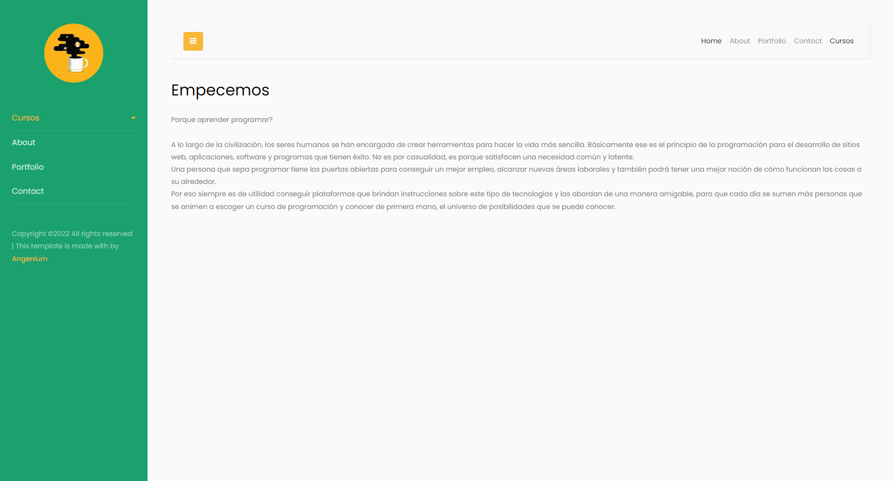

# Pagina Web de Cursos online

Esta es una aplicacion web basica la cual esta destinada a enseñar con una serie de cursos.


# Screenshot





# Docker

puede ejecutar un contenedor para el desarrollo

```shell
npm install
docker-compose up
```

# Enviroments
Esta aplicación necesita las siguientes variables de entorno
- `github-pages` this is the Mongodb URI string

link pagina
https://angelargumedo.github.io/website/src/index.html

# Recursos

- [Materia Bootswatch](https://www.bootstrapcdn.com/bootswatch/)
- [CSS Background uiGradients](https://uigradients.com/#Dull)

# Information aditional

Esta aplicación fue creada con fines educativos.